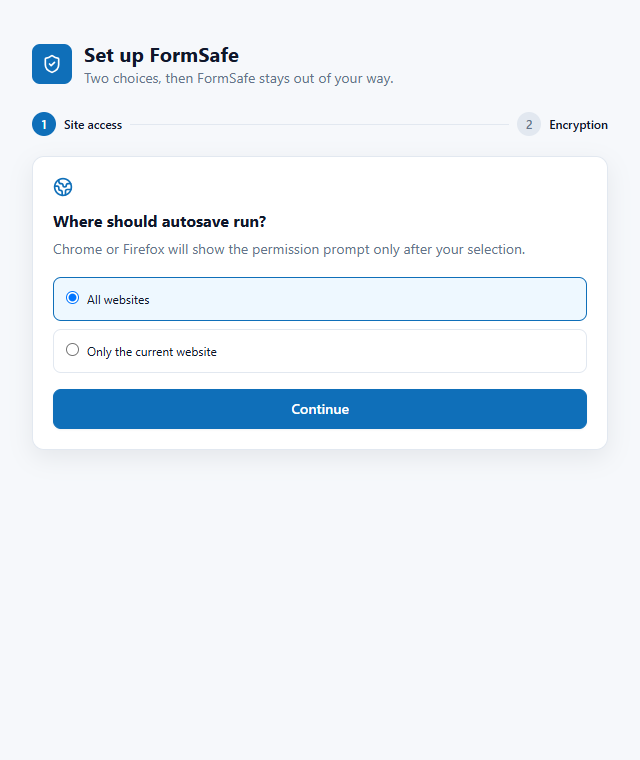

<p align="center">
  
</p>

<h1 align="center">FormSafe</h1>

<p align="center">
  <strong>Private, local form recovery for Chrome.</strong><br>
  Keep unfinished forms safe through refreshes, crashes, closed tabs, and accidental navigation.
</p>

<p align="center">
  <a href="https://github.com/MaryanKostrubyak/form-safe/releases/latest"></a>
  <a href="https://github.com/MaryanKostrubyak/form-safe/actions/workflows/ci.yml"></a>
  <a href="./LICENSE"></a>
  
</p>

<p align="center">
  
  
  
  
  
</p>

## Why FormSafe exists

A long support reply, application, issue report, or admin note can disappear after one bad refresh. Most websites do not protect text that has not been submitted yet.

FormSafe watches supported form fields and keeps recoverable versions locally in Chrome. When something goes wrong, you can restore the complete form, an earlier version, or one selected field. There is no account, backend, cloud sync, telemetry, analytics, or AI processing.

## Highlights

| | |
| --- | --- |
| **Complete form sessions** | Saves text, textarea, email, search, contenteditable, select, checkbox, and radio values that belong to the same form. |
| **10-version history** | Keeps meaningful checkpoints before clearing, restoring, submitting, leaving a page, and during longer editing sessions. |
| **Strict recovery targeting** | Restores only when origin, path, frame, and form signatures match. A draft cannot be inserted into an unrelated site. |
| **Optional encryption** | AES-256-GCM encrypted local storage with a session-only key, manual lock, and passphrase rotation. |
| **Private site access** | Requests access only after onboarding explains the choice between all websites and selected websites. |
| **Safe backups** | Creates encrypted `.formsafe` backups and validates imports before anything is written. |
| **Modern editor support** | Handles open Shadow DOM, iframes, ProseMirror, Quill, Lexical, TinyMCE, and CodeMirror 6. |
| **No silent cleanup of favorites** | Storage pruning starts with the oldest non-favorite completed or archived sessions. |

## Screenshots

Real screenshots captured from the production extension build.

### Recovery Side Panel

Search saved sessions, inspect fields and versions, restore content, create checkpoints, and manage completed or archived forms.


### Settings and local storage

Manage site access, encryption, recovery behavior, backups, language, appearance, and storage usage from one page.


<table>
  <tr>
    <td width="50%" valign="top">
      <strong>Quick popup</strong><br><br>
      Current-site status, saved session count, pause control, and one-click access to recovery.<br><br>
      
    </td>
    <td width="50%" valign="top">
      <strong>Permission onboarding</strong><br><br>
      Chrome requests site access only after the user chooses where autosave should run.<br><br>
      
    </td>
  </tr>
</table>

## Privacy by default

FormSafe never saves password, hidden, file, payment credential, token, OTP, PIN, SSN, IBAN, passport, API-key, or recovery-phrase fields. If a form contains a blocked sensitive field, the complete form is skipped by default.

- Drafts stay on the device.
- Extension pages do not load draft plaintext directly from browser storage.
- Session writes go through one serialized background queue.
- Settings and technical metadata use trusted-context storage access where Chrome supports it.
- Plain JSON export remains available, but it requires an explicit privacy confirmation.
- Forgotten encryption passphrases cannot be recovered.

## Install the release

1. Download [`formsafe-2.0.0-chrome.zip`](https://github.com/MaryanKostrubyak/form-safe/releases/download/v2.0.0/formsafe-2.0.0-chrome.zip).
2. Extract it to a permanent folder.
3. Open `chrome://extensions` and enable **Developer mode**.
4. Select **Load unpacked** and choose the extracted folder.

When updating an unpacked copy, replace the extracted files and select **Reload** on the Chrome extensions page. Chrome 116 or newer is required. Firefox is not included.

## Recovery workflow

```text
Website form
    ↓
Content script collects safe field snapshots
    ↓
Background worker validates and serializes writes
    ↓
IndexedDB stores the session and version history
    ↓
Side Panel requests a strict restore by session/version ID
    ↓
Only the matching page, frame, and form receives the fields
```

## Storage and migration

FormSafe stores up to approximately 50 MB or 2,000 sessions. Each session keeps no more than ten versions. Automatic pruning never removes favorites and starts with the oldest completed or archived sessions.

On first start after upgrading from 1.0, legacy field drafts are grouped into form sessions. FormSafe writes the new records, reads them back for verification, and only then removes the old storage entries.

## Development

```bash
pnpm install
pnpm dev
pnpm typecheck
pnpm lint
pnpm test:coverage
pnpm build
pnpm test:e2e
pnpm zip
```

`pnpm release:check` runs type checking, lint, unit and integration coverage, the Chrome production build, Chromium E2E tests, and release packaging.

Load the development build from:

```text
.output/chrome-mv3
```

## Project structure

```text
entrypoints/
  background.ts        Storage queue, migration, restore and permissions
  content.ts           Form detection, autosave and field recovery
  onboarding/          Site access and encryption setup
  popup/               Current-site controls
  sidepanel/           Session browser and restore workspace
  options/             Settings, encryption, storage and backups

src/
  components/          Shared React UI
  lib/v2/              Sessions, IndexedDB, crypto and backup logic
  styles/              Shared utility design system
  types.ts             Shared data contracts

tests/
  e2e/                 Chromium fixtures and visual regression
  *.test.ts            Unit and integration coverage
```

## Supported and unsupported editors

Supported: standard form controls, React-controlled inputs, contenteditable, open Shadow DOM, accessible iframes, ProseMirror, Quill, Lexical, TinyMCE, and CodeMirror 6.

Closed Shadow DOM and Monaco cannot be observed reliably, so FormSafe reports them as unsupported instead of claiming that their content was saved.

## Release and security information

- [Latest release](https://github.com/MaryanKostrubyak/form-safe/releases/latest)
- [Changelog](./CHANGELOG.md)
- [Security policy](./SECURITY.md)
- [Release notes](./RELEASE_NOTES.md)

## License

MIT. See [LICENSE](./LICENSE).
