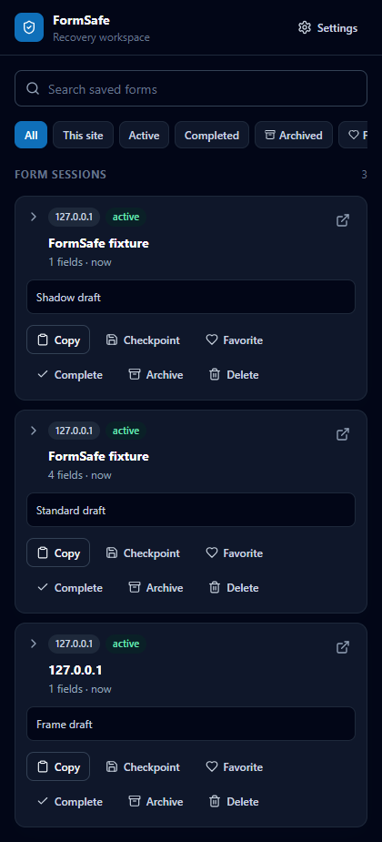
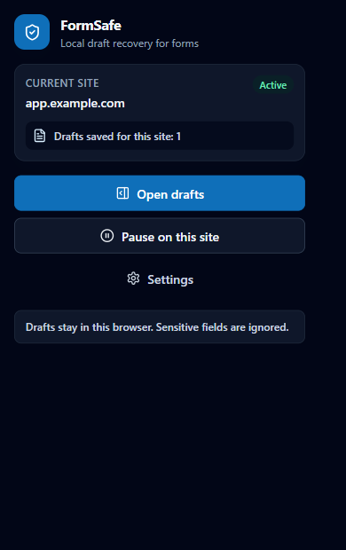
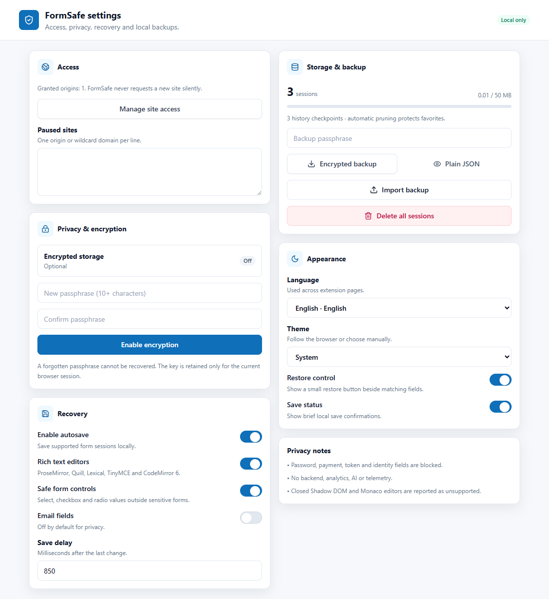
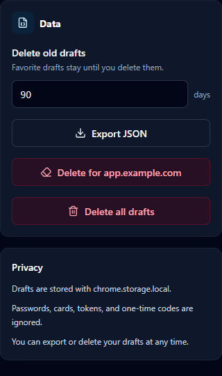

# FormSafe

**Privacy-first autosave for online forms**

FormSafe automatically saves form drafts locally and helps you recover lost text after refreshes, crashes, closed tabs, or accidental navigation.

[](https://github.com/MaryanKostrubyak/form-safe/releases/latest)
[](https://github.com/MaryanKostrubyak/form-safe/actions/workflows/ci.yml)
[](./LICENSE)


## The Problem

Writing in online forms is fragile. A long message, support request, application, comment, or admin note can disappear because of:

- Accidental refresh
- Closed tab
- Browser crash
- Page navigation
- Unstable websites
- Form reset
- Lost internet connection

Most websites do not protect in-progress text. FormSafe is built for the moment right after something goes wrong.

## The Solution

FormSafe watches supported, safe text fields while you type and stores drafts locally in Chrome. When you return to a page with a matching draft, it offers a simple restore action so the text can be inserted back into the field.

It also includes a side panel for browsing, searching, favoriting, copying, restoring, exporting, and deleting drafts. Nothing is sent to a server.

## Features

### Automatic form draft saving

FormSafe detects supported text fields and saves drafts after a short debounce, plus key lifecycle events like blur, page hide, visibility changes, form submit attempts, and form resets.

### One-click draft restore

When a saved draft matches the current page, FormSafe shows a small restore widget with options to insert, preview, or dismiss the draft.

### Recent drafts side panel

The Chrome Side Panel gives users a focused workspace for current page drafts, recent drafts, favorites, and archived drafts.

### Current page draft detection

Drafts are matched using page origin, pathname, field metadata, form signatures, field type, and fallback selectors.

### Search saved drafts

Search by domain, page title, field label, or draft content.

### Favorite drafts

Mark important drafts as favorites so they are easier to find and protected from automatic cleanup.

### Delete and export controls

Users can copy a draft, delete one draft, delete drafts for the current site, delete everything, or export all drafts as JSON.

### Per-site pause

Pause autosave on sites where draft saving is not needed.

### Sensitive field protection

FormSafe avoids passwords, payment fields, hidden inputs, file inputs, tokens, one-time codes, and fields with sensitive names.

### Local-only privacy model

No AI. No backend. No tracking. Drafts stay in the browser.

## Screenshots

Captured from the built FormSafe extension UI.

| Screenshot | Description |
| --- | --- |
|  | Manage drafts from the side panel. |
|  | Quick access from the extension popup. |
|  | Configure autosave behavior. |
|  | Control privacy and saved data. |

## How It Works

FormSafe is split into small extension layers:

### Content Script

- Detects supported form fields
- Listens for typing and field changes
- Avoids sensitive inputs
- Handles dynamic pages and SPA navigation
- Shows the restore widget and save status UI

### Background / Service Worker

- Handles extension messages
- Opens and configures the side panel
- Coordinates restore requests from extension UI to active tabs
- Runs cleanup logic

### Storage

- Saves drafts locally with `chrome.storage.local`
- Stores user settings
- Stores recent drafts and favorites
- Handles cleanup, export, and delete operations

### React UI

- Popup
- Side panel
- Options/settings page

```text
Website form
-> Content Script
-> Background Service Worker
-> Chrome Storage
-> Side Panel / Popup / Restore Widget
```

## Privacy First

FormSafe is designed as a local browser tool, not a cloud product.

- FormSafe does not use a backend.
- FormSafe does not use AI.
- FormSafe does not send drafts to any server.
- FormSafe does not sell or share user data.
- Drafts are stored locally in the browser with `chrome.storage.local`.
- Users can delete drafts at any time.
- Users can export drafts as JSON.
- Password, card, token, OTP, and sensitive fields are ignored.

## Sensitive Field Protection

FormSafe is built to avoid saving fields that are likely to contain private or dangerous data.

It should not save:

- Password fields
- Credit card fields
- Hidden fields
- File inputs
- Token or API key fields
- OTP and one-time-code fields
- Fields with sensitive names such as `password`, `token`, `secret`, `cvv`, `cvc`, or `card`

Sensitive detection checks field type, autocomplete hints, name, id, placeholder, labels, and related attributes.

## Tech Stack

| Technology | Purpose |
| --- | --- |
| WXT | Extension framework |
| React | Popup, side panel, and settings UI |
| TypeScript | Type-safe extension code |
| TailwindCSS | Styling and responsive UI |
| Lucide React | Icons |
| Chrome Storage API | Local draft and settings storage |
| Chrome Side Panel API | Draft management panel |
| Manifest V3 | Modern Chrome extension standard |
| pnpm | Package management |

## Installation

Install dependencies:

```bash
pnpm install
```

Start development mode:

```bash
pnpm dev
```

Build the extension:

```bash
pnpm build
```

Create a distributable zip:

```bash
pnpm zip
```

## Load as an Unpacked Chrome Extension

1. Build the extension with `pnpm build`.
2. Open Chrome and go to `chrome://extensions`.
3. Enable **Developer mode**.
4. Click **Load unpacked**.
5. Select the generated folder:

```text
.output/chrome-mv3
```

Then open any page with a supported text form, type a draft, refresh the page, and use the restore widget or side panel to insert the saved text.

## Development Commands

```bash
pnpm dev
pnpm build
pnpm zip
pnpm typecheck
pnpm lint
pnpm release:check
```

## Release Process

1. Update `CHANGELOG.md`.
2. Ensure `package.json` has the target version.
3. Run `pnpm release:check`.
4. Create and push a tag in `vX.Y.Z` format (for example `v1.0.0`).
5. GitHub Actions publishes a release with the extension zip and SHA256 checksum.

## Project Structure

```text
entrypoints/
  background.ts        Chrome service worker
  content.ts           Form detection, autosave, restore widget
  popup/               Extension popup UI
  sidepanel/           Draft management side panel
  options/             Settings page

src/
  components/          Reusable React components
  lib/                 Storage, messages, settings, i18n, formatting
  styles/              Tailwind entry styles
  types.ts             Shared TypeScript types

screenshots/           GitHub README screenshot assets
```

## Permissions

FormSafe uses only the permissions needed for the MVP:

- `storage` - save drafts and settings locally.
- `sidePanel` - open and render the Chrome Side Panel.
- `activeTab` - interact with the active tab after user action.
- `<all_urls>` host permission - required for autosave across arbitrary websites with forms.

The broad host permission is needed because FormSafe protects forms on many websites, not a fixed allowlist. Sensitive fields are filtered before saving.

## Chrome Web Store

Coming soon.

## Findability Checklist

For better GitHub search visibility, keep these values updated in the repository **About** panel:

- Description: `Privacy-first Chrome extension that autosaves form drafts locally and helps recover lost text after refreshes, crashes, closed tabs, and navigation.`
- Website: `https://github.com/MaryanKostrubyak/form-safe#readme` (or Chrome Web Store link after publishing)
- Topics: `chrome-extension`, `browser-extension`, `form-autosave`, `form-recovery`, `privacy-first`, `local-first`, `manifest-v3`, `wxt`, `react`, `typescript`, `chrome-storage`, `productivity`
- Social preview image: add a dedicated banner screenshot when available

## Roadmap

- Encrypted local drafts
- Per-site rules
- Manual named drafts
- Markdown preview
- Advanced field detection
- Optional sync in the future
- Firefox support
- Chrome Web Store publishing

## Status

`1.0.0` is the first public stable release focused on local-first draft recovery. FormSafe is not connected to any backend service and does not require an account.
